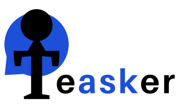
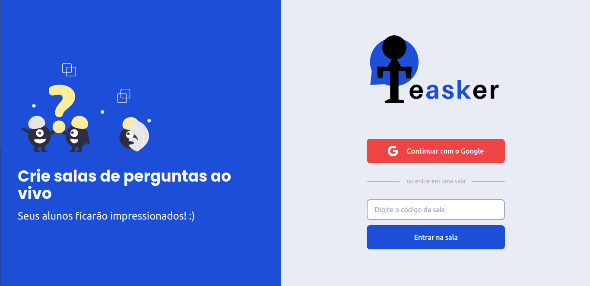

<div align="center">

</div>
<div align="center">
  
  
  

  
</div>

<main style="margin-top: 50px;">
  <h1>
    Facilite suas lives respondendo perguntas de forma democrática. :)
  </h1>
  
</main>

<br>

## 🧪 Tecnologias

Esse projeto foi desenvolvido com as seguintes tecnologias:

- [React](https://reactjs.org)
- [Firebase](https://firebase.google.com/)
- [TypeScript](https://www.typescriptlang.org/)
- [TailwindCSS](https://tailwindcss.com/)

## 🚀 Como executar

Clone o projeto e acesse a pasta do mesmo.

```bash
$ git clone https://github.com/carloseduardodb/teasker.git
$ cd teasker
```

Para iniciá-lo, siga os passos abaixo:

```bash
# Instalar as dependências
$ yarn

# Iniciar o projeto
$ yarn start
```

O app estará disponível no seu browser pelo endereço http://localhost:3000.

Lembrando que será necessário criar uma conta no [Firebase](https://firebase.google.com/) e um projeto para disponibilizar um Realtime Database.

## 💻 Projeto

Teasker é perfeito para você utilizar nas suas aulas ao vivo.

Este é um projeto desenvolvido durante a **[Next Level Week Together](https://nextlevelweek.com/)**, apresentada dos dias 20 a 27 de Junho de 2021 juntamente com modificações feitas por mim.

## 🔖 Modificações

- Responsividade
- Visualização das salas criadas e possibilidade de voltar ou reabrir as mesmas
- Modificações no layout(cores, organização dos componentes)
- Modo dark adicionado
- Todo o layout foi construido com o tailwindCSS
- Os icones do sistema são de um pacote de icones ao inves de importações de arquivo.
- Novas regras adicionadas no firebase para a limitação de algumas ações de usuários não autorizados.
- Novos campos adicionados no firebase.
- Organização das perguntas mais curtidas.
- Telas de erro adicionadas quando o usuário entra em partes não autorizadas.

## 🔖 Algumas telas do projeto modificado


<br/>
<br/>


## 🔖 Layout do projeto original

Você pode visualizar o layout do projeto através do link abaixo: (Obs: Não segui as regras de layout do curso fiz o projeto todo usando Tailwind).

- [Layout Web](https://www.figma.com/file/u0BQK8rCf2KgzcukdRRCWh/Letmeask/duplicate)

Lembrando que você precisa ter uma conta no [Figma](http://figma.com/).

## 📝 License

Esse projeto está sob a licença MIT. Veja o arquivo [LICENSE](LICENSE.md) para mais detalhes.

---

Feito com ❤️ by Carlos Eduardo Dias Batista
